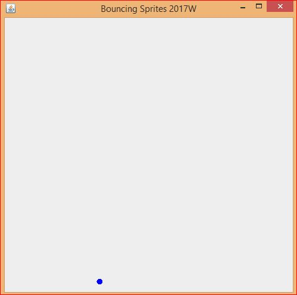
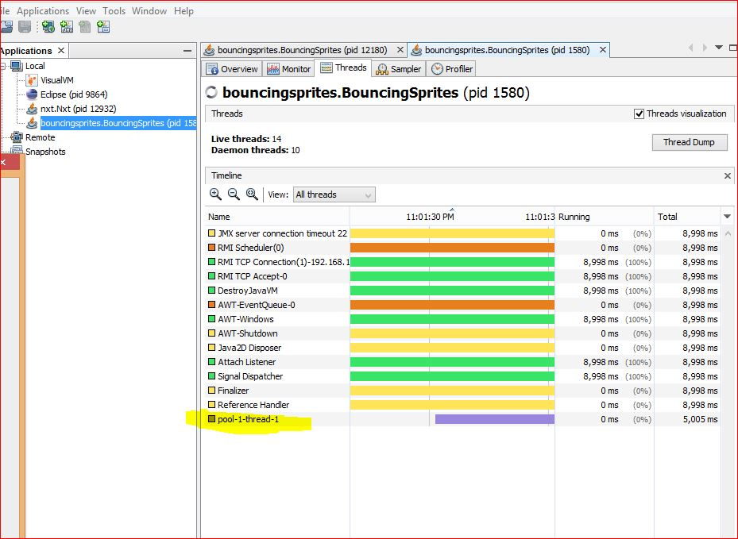

# Java Sprites

This is my first assignment for my college course Enterprise Programming.
 
The project was our first time using threads and is now a very small project knowing what I know now.

All this project does is runs an animated "sprite"(coloured ball) on a new thread.

